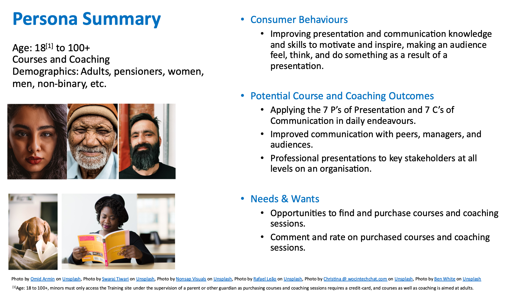
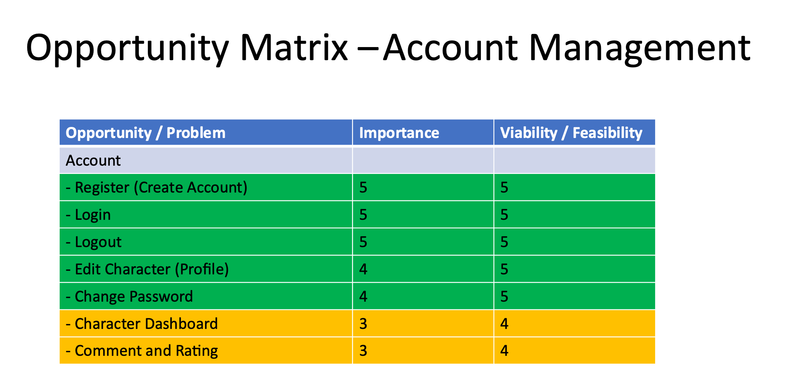
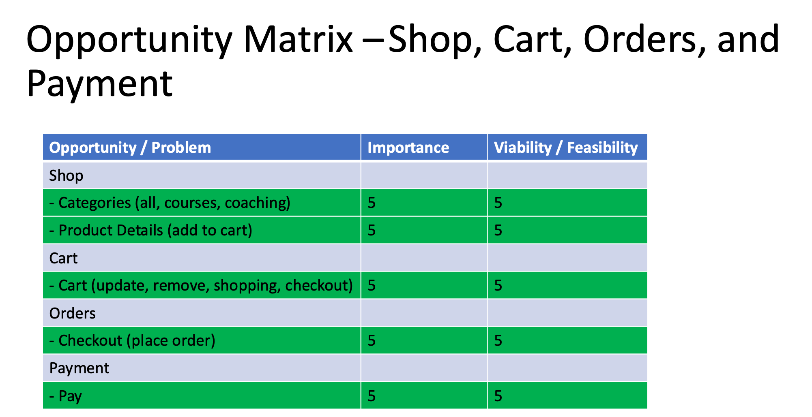
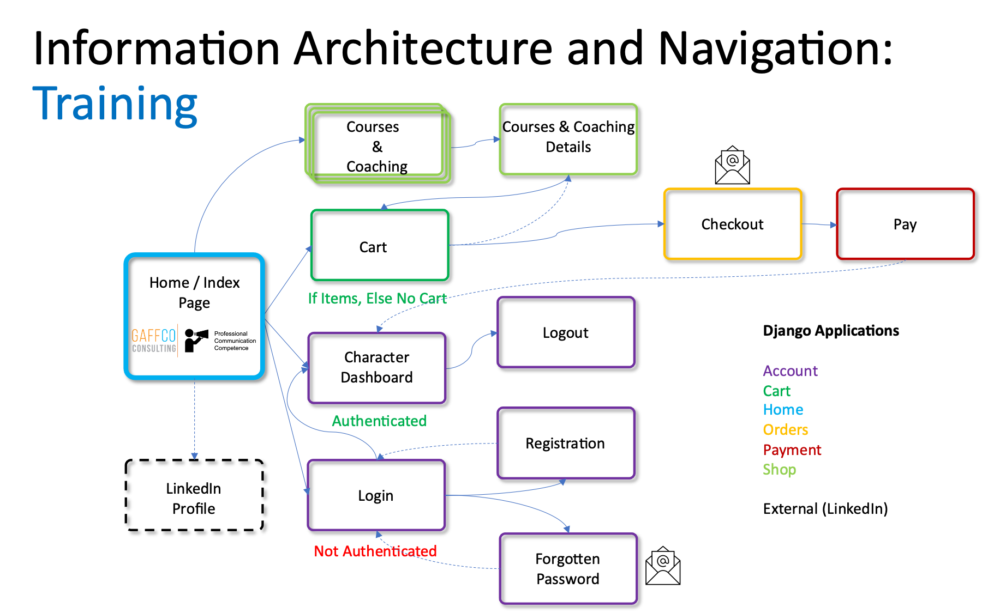

# Professional Communication and Presentation Skills E-Commerce Website

"Organisations Achieve Greater Value through Professionally Coached Employees." - Gaff

Professional Communication and Presentation Skills - 4th Milestone Project for the Code Institute's Diploma in Full Stack Development. Project requirements: HTML 5, CSS 3, JavaScript, Python 3, Django, PostgreSQL, Payment System, and API's. This project website is an e-commerce site for a Professional Communications and Presentation Skills Company (Sole Trader) called GaffCo Consulting.


## Table of Contents

<details><summary>Please click to expand: Table of Contents</summary>

- [Business](#business)
  * [External User's (Consumer) Goals](#external-user-s--consumer--goals)
  * [Site Owner's Goals](#site-owner-s-goals)
- [User Experience](#user-experience)
  * [Persona Summary of the Consumer](#persona-summary-of-the-consumer)
  * [Strategy Trade-Off](#strategy-trade-off)
    + [Opportunity Matrices for Training and Development](#opportunity-matrices-for-training-and-development)
  * [User Stories, Use Cases, and Tasks Mapped to Information Architecture and Navigation](#user-stories--use-cases--and-tasks-mapped-to-information-architecture-and-navigation)
  * [Wireframes](#wireframes)
- [Features](#features)
  * [Existing Features](#existing-features)
  * [Features Left to Implement](#features-left-to-implement)
- [Technologies Used](#technologies-used)
  * [Database Schema](#database-schema)
- [Testing](#testing)
  * [Validation of HTML, CSS, JS, and Python Code](#validation-of-html--css--js--and-python-code)
  * [Manual Beahviour Driven Development Testing](#manual-beahviour-driven-development-testing)
  * [Automated Behaviour Driven Development Testing using Selenium IDE and PyTest](#automated-behaviour-driven-development-testing-using-selenium-ide-and-pytest)
    + [BDD Test '.env' File](#bdd-test--env--file)
    + [BDD PyTest Code](#bdd-pytest-code)
    + [BDD Test Results - PASS](#bdd-test-results---pass)
- [Deployment](#deployment)
  * [GitHub](#github)
  * [Configure Visual Studio Code environment](#configure-visual-studio-code-environment)
  * [Create the Initial Django Project](#create-the-initial-django-project)
  * [Django Migrations (Version Control System for the Database Schema)](#django-migrations--version-control-system-for-the-database-schema-)
  * [Configure static and media for Django](#configure-static-and-media-for-django)
  * [Install django-environ to read a '.env' file with both confidential and useful variables -> Heroku Variables and PyTest Variables](#install-django-environ-to-read-a--env--file-with-both-confidential-and-useful-variables----heroku-variables-and-pytest-variables)
    + [Heroku Platform Configuration and Deployment](#heroku-platform-configuration-and-deployment)
      - [Herokue Config Vars (minus `DISABLE_COLLECTSTATIC=1` which is a temporary variable)](#herokue-config-vars--minus--disable-collectstatic-1--which-is-a-temporary-variable-)
    + [PostgreSQL Configuration](#postgresql-configuration)
    + [AWS S3 Bucket Configuration](#aws-s3-bucket-configuration)
- [Key Issues](#key-issues)
- [Credits](#credits)
  * [Content](#content)
  * [Media](#media)
  * [Acknowledgements](#acknowledgements)

<small><i><a href='http://ecotrust-canada.github.io/markdown-toc/'>Table of contents generated with markdown-toc</a></i></small>

</details>


## Business
The Business goals describe the expected consumer and site owner goals, and drive the design, development, and deployment of the application which in this case is the Professional Training and Development E-commerce site. The fulfilment of these goals determine the success of the application.

### External User's (Consumer) Goals
Find suitable courses and coaching sessions to improve presentation and communication skills to get their audience to feel, think, and ideally do something as a result of a presentation.

### Site Owner's Goals
Motivate and inspire learners (consumers) to achieve excellent results through presentation and communication skills by attending the courses and coaching sessions provided on this site.


## User Experience
User experience (UX) design is the design process used to create applications and websites that provide meaningful and relevant experiences to users.

### Persona Summary of the Consumer

This site is aimed at individuals at age 18 and above, and businessess seeking professional courses and coaching on presentation and communication skills. Consumers can view the courses and coaching sessions on offer to select the ones most suitable to their requirements to increase their knowledge, improve their skills and give them the confidence to put the new knowledge and skills to good use.

### Strategy Trade-Off
UX Design is driven by business goals and user needs, and features developed are aligned to these. However, each feature requires time and effort, and often time is constrained as is effort as the greater the effort the higher the cost. Therefore some features are prioritised or mandatory, while others are optional and developed pending time and ultimately cost.

The selected features are driven by the opportunity matrix, which helps us understand what is both more important and viable to create. In this case all features mentioned below are implemented as the features made sense to provide in this initial release. Additional and future features are documented under the Features section, and not documented here.

#### Opportunity Matrices for Training and Development




[Initial Plans for MS4](Documentation/MS4.pdf) scribbled on a several A4 pages (PDF). This gave me purpose and direction for the project. However, time contraints and continuous assessments changed the initial plan.

### User Stories, Use Cases, and Tasks Mapped to Information Architecture and Navigation

The User Experience links the Business goals of the external user and site owner to a number of user stories. A user story captures a description of a software feature from an end-user perspective. A user story describes the type of user, what they want and why. A use case is a list of actions or event steps describing the interactions between a role and a system to achieve a goal.

A user story has one or more use cases with one or more tasks with steps associated with it, describing how the user story, and subsequent fulfilment of the external user's and site owner's business goals are realised: Business Goals -> User Story -> Use Case(s) -> Task(s).

---



The User Experience links the Business goals of the external user (consumer) and site owner to a number of user stories. A user story captures a description of a software feature from an end-user perspective. A user story describes the type of user, what they want and why. A use case is a list of actions or event steps describing the interactions between a role and a system to achieve a goal.

A user story has one or more use cases with one or more tasks with steps associated with it, describing how the user story, and subsequent fulfilment of the external user's and site owner's business goals are realised: Business Goals -> User Story -> Use Case(s) -> Task(s).

Information Architecture is hierarchical (home -> shop, home -> character, home -> cart) and sequential (shop -> cart -> orders -> payment). The navigation bar provides the same options for anymous and logged in consumers.

---

* **User Story 001 (Consumer):** As a consumer, I want to view and purchase the courses and coaching sessions on offer so that I can attend them to improve my professional presentation and communication skills.
	* **Use Case 001-001 - View Home / Index Page and LinkedIn Profile:** As a consumer I want to view what GaffCo Consulting is all about, and what is on offer.
		* **Task 1:** Access the home / index page [Training and Development](https://training-and-development.herokuapp.com/). Scroll through the content on the page.
		* **Task 2:** Click on the LinkedIn Profile link to access further details about the owner of GaffCo Consulting.
	* **Use Case 001-002 - Register, Login, Logout:** As a consumer I want to register, login, and logout to access further future content and details.
		* **Task 1:** Access the character dashboard via the naviagation bar menu [Character Dashboard](https://training-and-development.herokuapp.com/account/dashboard/).
		* **Task 2:** Click on [Register Here](https://training-and-development.herokuapp.com/account/register/) to create an account. Fill in the details in the form and click on "Create my account" button.
		* **Task 3:** Click on [Log-in](https://training-and-development.herokuapp.com/account/login/), enter your username and password, and click on the "Log-in" button.
		* **Task 4:** Perform the relevant actions on the website.
		* **Task 5:** Click on [Logout](https://training-and-development.herokuapp.com/account/logout/) when done.
	* **Use Case 001-003 - View and Purchase Courses and Coaching Sessions:** As a consumer I want to view and purchase courses and coaching sessions to increase my knowledge and improve my skills.
		* **Task 1:** Access the home / index page [Training and Development](https://training-and-development.herokuapp.com/).
		* **Task 2:** Click on "Courses & Coaching" in the naviagation bar and select either "All Training" or "Courses" or "Coaching".
		* **Task 3:** Use the carousel to find a course or coaching session you want to view the details of, and potentially purchase.
		* **Task 4:** Select (click on) on the course or coaching session you want further details on, and potentially want to purchase.
		* **Task 5:** Review the details of the course or coaching session. If required, updated the number of course seats or coaching sessions, and click on "Add to cart".
		* **Task 6:** Review your choice, update the number of course or coaching sessions, or remove if you change your mind. Review the price, item price, total item price, and the total price. If you want to add further courses or coaching sessions, click on "Continue shopping". If happy with your choice click on the "Checkout" button.
		* **Task 7:** Review your order before filling in the Checkout Form. If happy click on the "Place order" button.
		* **Task 8:** Fill in the credit-card payment form and click on the "Pay" button.
		* **Task 9:** Continue shopping, or click on [Home](https://training-and-development.herokuapp.com/), or close the browser.
	* **Use Case 001-004 - Edit / Update the Character (Consumer) Profile:** As a consumer I want to edit / update my Character (Consumer) Profile for future features and content.
		* **Task 1:** Access the character dashboard via the naviagation bar menu [Character Dashboard](https://training-and-development.herokuapp.com/account/dashboard/).
		* **Task 2:** Click on [Log-in](https://training-and-development.herokuapp.com/account/login/), enter your username and password, and click on the "Log-in" button.
		* **Task 3:** Click on [edit your profile](https://training-and-development.herokuapp.com/account/edit/).
		* **Task 4:** Update the Character Profile form and click on "Save changes" when done. A Django message pop-up provides feedback on whether the update is successful or not. Click on [Character Dashboard](https://training-and-development.herokuapp.com/account/dashboard/).
	* **Use Case 001-005 - Change Password:** As a consumer I want to change my password.
		* **Task 1:** Access the character dashboard via the naviagation bar menu [Character Dashboard](https://training-and-development.herokuapp.com/account/dashboard/).
		* **Task 2:** Click on [Log-in](https://training-and-development.herokuapp.com/account/login/), enter your username and password, and click on the "Log-in" button.
		* **Task 3:** Click on [change your password](https://training-and-development.herokuapp.com/account/password_change/), enter your current password, your new password, your new password a second time, and click on the "Change" button.
		* **Task 4:** Click on the [Character Dashboard](https://training-and-development.herokuapp.com/account/dashboard/) and [Logout](https://training-and-development.herokuapp.com/account/logout/).
	* **Use Case 001-006 - Password Reset:** As a consumer I want to reset my password as I have forgotten my current password and want to gain access to my account.
		* **Task 1:** Access the character dashboard via the naviagation bar menu [Character Dashboard](https://training-and-development.herokuapp.com/account/dashboard/).
		* **Task 2:** Click on [Forgotten your password?](https://training-and-development.herokuapp.com/account/password_reset/).
		* **Task 3:** Enter your e-mail address (same one used to register) and click on the "Send e-mail" button.
		* **Task 4:** Once you receive your password reset e-mail, click on the link to reset your password.
		* **Task 5:** Enter your new password, confirm your new password and click on the "Change my password" button.

---

* **User Story 002 (Admin):** As an administrator I want to create, read, update and delete database items from the admin view to maintain the site.
	* **Use Case 002-001 - Authentication and Authorization:** As an admin I want to manage users and groups on the site. - [Authentication and Authorization](https://training-and-development.herokuapp.com/admin/auth/) CRUD functions for Groups (not currently ised) and Users. Using Django authorization. 
	* **Use Case 002-002 - Account:** As an admin I want to manage Character Profiles. - [Account](https://training-and-development.herokuapp.com/admin/account/). Consumer updates to their Character Profile is managed here.
	* **Use Case 002-003 - Shop:** As an admin I want to manage the product categories and prodcuts provided to the Consumers. - [Shop](https://training-and-development.herokuapp.com/admin/shop/).
	* **Use Case 002-004 - Orders:** As an admin I want to manage the orders placed by Consumers. - [Orders](https://training-and-development.herokuapp.com/admin/orders/)

---

### Wireframes

[Wireframes for Desktops (Large) and Tablets (Medium), and Mobile (Small) - PDF](Documentation/MS4%20Wireframes.pdf)

The wireframes cover Desktop and Tablet sized devices as one, as the design and look is the same for both. Mobile devices are similar, with the main difference being the hamburger-nav-bar instead of a full navigation bar, and the fact that most text and images flows to one column. I did this on purpose, to keep the style and layout both functional and simple, requiring less CSS "shenanigans".


## Features

A feature is some action that can be performed by a user of an application, or is some internal function of an application. The features support the User Experience mentioned above and are implemented based on the business goals, user stories and use cases.
 
### Existing Features
* **Django App - Home:** Home / Index Page provides an introduction to GaffCo Consulting, and overview of the courses and coaching sessions that are provided.
	* Navigation Bar / Hamburger-Nav-Bar (Materialize CSS 1.0.0)
		* Logo Link to Home / Index Page (Logo is my own)
		* Courses & Coaching Drop-Dowm (Materialize CSS 1.0.0) -> *Django App - Shop*
			* All Training (all categories) -> Carousel
			* Courses (category) -> Courses Carousel
			* Coaching (category) -> Coaching Carousel
	* Parallax - Mountain Success x 3 (Materialize CSS 1.0.0)
	* Banner / Tagline for Professional Training and Development
	* GaffCo Consulting description, course and coaching tabs with links and descriptions to courses and coaching sessions.
	* Fixed Footer
		* LinkedIn Profile Link
		* Copyright Notice
* **Django App - Shop:** All Training / Courses / Coaching Carousel.
	* Views of available courses and coaching sessions in a carouesel.
	* Carousel courses and coaching sessions are selectable to view in greater detail and are available to purchase.
	* Detailed view of course or coaching session.
	* Ability to select number of courses and coaching sessions and add to cart.
	* Submit cart -> *Django App - Cart*
* **Django App - Cart:** View and checkout course and coaching items in cart.
	* View cart contents, with image, title, number of the item, item price, total item price, and total price of all products.
	* Add additional number of items and update cart contents, updating item price and total item price, as well as the total price of all products.
	* Products can be removed with the remove button.
	* Consumer can continue shopping, add further products/items.
	* Consumer can checkout -> *Django App - Checkout*
* **Django App - Checkout:** Fill in the checkout form to place the order.
	* Checkout form to place the order and receive an e-mail confirmation -> *Django App - Payment*
* **Django App - Payment:** Fill in the credit-card details and click Pay to purchase the items.
	* Consumer can fill in the credit-card details to purchase the items ordered.
	* Consumer gets a payment done (success or failure) wiht a link to home -> *Django App - Home*
* **Django App - Account:** Consumer Authentication and Authorisation.
	* Consumer can register, login, edit character profile, change password, reset password (e-mail notification), and logout.
	* Consumer Dashboard access.

### Features Left to Implement
* **NEW - Django App - Order Rating and Comments:**
* **NEW - Django App - Courses:** Add online course content for some courses linked to YouTube videos.
* **NEW - Django App - Accreditation:** Create accrediation views, course diplomas, and success trees for consumers.
* **Existing - Django App - Account:** Add additional e-mail notifications. Add a subscription model to access online courses and coaching sessions.
* **Existing - Django App - Dashboard:** Improve Character Profile with additional details like a photo and courses purchased, and courses taken.
* **Existing - Django App - Payment:** Fill in payment details if consumer is authenticated and a character profile exists.


## Technologies Used

Some of the technology choices are governed by the Milestone Project requirements, while all others are my own choice (good, bad, and downright awful).

For the fourth Milestone Project for the Diploma in Full Stack Development at the Code Institute, the following mandatory technology choices apply: HTML5, CSS 3, JavaScript, Python 3, Django Framework, Payment System, and PostgreSQL.

* [HTML 5.2. - W3C Recommendation, 14 December 2017](https://www.w3.org/TR/html52/)
	* The project uses HTML 5 to create the content.
* [CSS 3 CSS - Snapshot 2018 W3C Working Group Note, 22 January 2019](https://www.w3.org/TR/css-2018/)
	* The project uses CSS 3 to style the content and provide the layout.
* [ECMAScript® 2015 Language Specification](http://www.ecma-international.org/ecma-262/6.0/)
	* The project uses JavaScript, based on the ECMAScript language specification and implemented by numerous browser vendors. As a general rule, I read the implementation of this at [MDN web docs](https://developer.mozilla.org/en-US/docs/Web/JavaScript).
* [Python](https://www.python.org/)
	* An interpreted, high-level, and general-purpose programming language.
* [Code Institute GitPod Full Template](https://github.com/Code-Institute-Org/gitpod-full-template)
	* Using the GitPod Full Template from the Code Institute for my project.
* [DropBox](https://www.dropbox.com/)
	* Using DropBox as a staging area for Visual Studio Code, and synching this with GitHub.
* [Visual Studio Code](https://code.visualstudio.com/)
	* Main development editor (IDE).
* [GitHub](https://github.com/)
	* Project repository.
* [Heroku](https://heroku.com/)
	* Review Application, Staging, and Production environments.
* [Gunicorn - WSGI Server](https://docs.gunicorn.org/en/stable/)
	* Web Server used on Heroku for this project.
* [Microsoft PowerPoint](https://office.live.com/start/powerpoint.aspx)
	* Training logo, the Information Architecture diagrams, the Opportunity Matrices, and Persona Summary.
* [Quick Database Diagrams](https://app.quickdatabasediagrams.com/#/)
	* Book Repository PostgreSQL Schema was drawn using QDD.
* [Tables Generator](https://www.tablesgenerator.com/markdown_tables)
	* Tables are created using MarkDown Tables Generator.
* [MacDown](https://macdown.uranusjr.com/)
	* Document is created with MacDown.
* [GitHub Wiki TOC Generator](https://ecotrust-canada.github.io/markdown-toc/)
	* Creating the Table-of-Contents.
* "Pen and Paper" on an e-ink device converted to PDF for the Wireframe Diagrams.

### Database Schema

Please note that the there is currently no database link between the auth_user or account_profile to orders_orders. As a future feature, having the order form populated with data from the auth_user and account_profile when authtenticated would add a useful feature to the consumer.

<details><summary>Please click to expand: Quick Databse Diagrams Description</summary>

```
account_profile
--
id PK int
user_id int FK -< auth_user.id
address varchar(80)
post_code varchar(80)
city varchar(80)
 
auth_user
--
id PK int
username varchar(150)
password varchar(128)
last_login datetime
first_name varchar(150)
last_name(150)
email varchar(254)
is_superuser bool
is_staff bool
is_active bool
date_joined datetime
 
orders_order
--
id PK int
first_name varchar(50)
last_name varchar(50)
email varchar(254)
address varchar(250)
postal_code varchar(20)
city varchar(100)
created datetime
updated datetime
paid bool
braintree_id varchar(150)
 
orders_orderitem
--
id PK int
price decimal
quantity int
order_id int FK >- orders_order.id
product_id int FK >- shop_product.id
rating int
comment varchar(250)
 
shop_category
--
id PK int
name varchar(200)
slug varchar(200)
 
shop_product
--
id PK int
name varchar(200)
slug varchar(200)
image varchar(100)
description text
price decimal
available bool
created datetime
updated datetime
category_id int FK >- shop_category.id
```

</details>

Please note that the Django tables are not included in this diagram.


## Testing
Business Driven Development aims to overcome the common mismatch between the Business and IT. BDD consists of a continuous cycle of Modelling -> Building -> Deploying -> Managing. Testing is a part of Building, through unit, integration, and regression testing. These tests won't validate the user experience in the form of user stories and use cases. Behaviour Driven Development (BDD) is a branch of Test Driven Development (TDD). BDD uses human-readable descriptions of software user requirements as the basis for software tests.

BDD Testing is performed manually, and automated using Selenium IDE exported to PyTest code.

### Validation of HTML, CSS, JS, and Python Code
Validation tools used are [Nu HTML Checker](https://validator.w3.org/nu/), [Jigsaw](https://jigsaw.w3.org/css-validator/), [JSHint](https://jshint.com/), [PEP8 Online](http://pep8online.com/), [autopep8 (locally, CLI)](https://pypi.org/project/autopep8/) and [Python Syntax Checker](https://extendsclass.com/python-tester.html).

### Manual Beahviour Driven Development Testing
Running the manual tasks validate the Use Case, and in turn the User Story. A test will either Pass or Fail.

| User Story                                                                                                                                                                                                   | Use Case                                                                                                                                                                                                                                                                      | Pass / Fail |
|--------------------------------------------------------------------------------------------------------------------------------------------------------------------------------------------------------------|-------------------------------------------------------------------------------------------------------------------------------------------------------------------------------------------------------------------------------------------------------------------------------|-------------|
| User Story 001 (Consumer): As a consumer, I want to view and purchase the courses and coaching sessions on offer so that I can attend them to improve my professional presentation and communication skills. | Use Case 001-001 - View Home / Index Page and LinkedIn Profile: As a consumer, I want to view what GaffCo Consulting is all about, and what is on offer.                                                                                                                      | Pass        |
|                                                                                                                                                                                                              | Use Case 001-002 - Register, Login, Logout: As a consumer, I want to register, login, and logout to access further future content and details.                                                                                                                                | Pass        |
|                                                                                                                                                                                                              | Use Case 001-003 - View and Purchase Courses and Coaching Sessions: As a consumer, I want to view and purchase courses and coaching sessions to increase my knowledge and improve my skills.                                                                                  | Pass        |
|                                                                                                                                                                                                              | Use Case 001-004 - Edit / Update the Character (Consumer) Profile: As a consumer I want to edit / update my Character (Consumer) Profile for future features and content.                                                                                                     | Pass        |
|                                                                                                                                                                                                              | Use Case 001-005 - Change Password: As a consumer I want to change my password.                                                                                                                                                                                               | Pass        |
|                                                                                                                                                                                                              | Use Case 001-006 - Password Reset: As a consumer I want to reset my password as I have forgotten my current password and want to gain access to my account.                                                                                                                   | Pass        |
|                                                                                                                                                                                                              |                                                                                                                                                                                                                                                                               |             |
| User Story 002 (Admin): As an administrator I want to create, read, update and delete database items from the admin view to maintain the site.                                                               | Use Case 002-001 - Authentication and Authorisation: As an admin I want to manage users and groups on the site. - [Authentication and Authorization](https://training-and-development.herokuapp.com/admin/auth/) CRUD functions for Groups (not currently ised) and Users. Using Django authorization. | Pass        |
|                                                                                                                                                                                                              | Use Case 002-002 - Account: As an admin I want to manage Character Profiles. - [Account](https://training-and-development.herokuapp.com/admin/account/). Consumer updates to their Character Profile is managed here.                                                                                  | Pass        |
|                                                                                                                                                                                                              | Use Case 002-003 - Shop: As an admin I want to manage the product categories and prodcuts provided to the Consumers. - [Shop](https://training-and-development.herokuapp.com/admin/shop/).                                                                                                             | Pass        |
|                                                                                                                                                                                                              | Use Case 002-004 - Orders: As an admin I want to manage the orders placed by Consumers. - [Orders](https://training-and-development.herokuapp.com/admin/orders/4                                                                                                                                       | Pass        |


### Automated Behaviour Driven Development Testing using Selenium IDE and PyTest
Selenium IDE runs automated, and scripted tests when configured. In this case the Selenium IDE recording function is used to create the scripts, the scripts are exported to PyTest code, and then run to validate the test cases.

To prepare for the tests:
* Install pytest, selenium and the correct webdriver (ChromeDriver)
	* pip3 install pytest
	* pip3 install selenium
	* http://chromedriver.chromium.org/downloads
		* Unzip and copy 'chromedriver 2' to the virtual Python/bin directory. Rename it to 'chromedriver'.
		* Execute chromedriver in the terminal to ensure the correct version is running; it has to match the version in "About Google Chrome". If using other browsers, other webdrivers must be installed. Don't do "pip3 install ChromeDriver" as it's likely to install an older version which means that the tests won't run as Chrome can't be controlled.
* Create a new '.env' file at the Project Root. Add the following variables, with values:

#### BDD Test '.env' File

<details><summary>Please click to expand: Test '.env' File with Variables</summary>

```
USER_TEST_NAME=<name>
USER_TEST_PASSWORD=<your password>
NEW_USER_TEST_NAME=<test_user_name>
NEW_USER_FIRST_NAME=<new_name>
NEW_USER_EMAIL=<your email>
NEW_USER_TEST_PASSWORD=<secret password>
PROFILE_FIRST_NAME=<profile_name>
PROFILE_LAST_NAME=<profile_surname>
PROFILE_EMAIL=<profile_email>
PROFILE_ADDRESS=<profile_address>
PROFILE_POST_CODE=<profile_post_code>
PROFILE_CITY=<profile_city>
PASSWORD_CHANGE_PASSWORD=<change_to_this_password>
```
</details>

#### BDD PyTest Code

<details><summary>Please click to expand: PyTest Code</summary>

* Execute the test: `pytest`. Runs `test_trainingBDDSuite.py`.

```
# Generated by Selenium IDE and refined by Gaff
import pytest
import time
import json
from selenium import webdriver
from selenium.webdriver.common.by import By
from selenium.webdriver.common.action_chains import ActionChains
from selenium.webdriver.support import expected_conditions
from selenium.webdriver.support.wait import WebDriverWait
from selenium.webdriver.common.keys import Keys
from selenium.webdriver.common.desired_capabilities import DesiredCapabilities

# Read '.env' file created for Testing Parameters stored in Project Root
import environ
import os
root = environ.Path(__file__) - 3  # get root of the project
env = environ.Env()
environ.Env.read_env()  # reading .env file

class TestTrainingBDDSuite():
  def setup_method(self, method):
    self.driver = webdriver.Chrome()
    self.vars = {}
  
  def teardown_method(self, method):
    self.driver.quit()
  
  def wait_for_window(self, timeout = 2):
    time.sleep(round(timeout / 1000))
    wh_now = self.driver.window_handles
    wh_then = self.vars["window_handles"]
    if len(wh_now) > len(wh_then):
      return set(wh_now).difference(set(wh_then)).pop()
  
  def test_useCase001ViewHomePageandLinkedIn(self):
    self.driver.get("https://training-and-development.herokuapp.com/")
    self.driver.set_window_size(1680, 975)
    self.vars["window_handles"] = self.driver.window_handles
    time.sleep(5)
    self.driver.find_element(By.LINK_TEXT, "Connect: LinkedInlink").click()
    self.vars["win7260"] = self.wait_for_window(2000)
    self.driver.switch_to.window(self.vars["win7260"])
  
  def test_useCase002RegisterLoginLogout(self):
    self.driver.get("https://training-and-development.herokuapp.com/")
    self.driver.set_window_size(1680, 975)
    self.driver.find_element(By.CSS_SELECTOR, "#nav-mobile > li:nth-child(2) > .black-text").click()
    self.driver.find_element(By.CSS_SELECTOR, ".container > a:nth-child(1)").click()
    self.driver.find_element(By.CSS_SELECTOR, "#nav-mobile > li:nth-child(2) > .black-text").click()
    self.driver.find_element(By.LINK_TEXT, "register here").click()
    self.driver.find_element(By.ID, "id_username").send_keys(os.environ.get("NEW_USER_USERNAME"))
    self.driver.find_element(By.ID, "id_first_name").send_keys(os.environ.get("NEW_USER_FIRST_NAME"))
    self.driver.find_element(By.ID, "id_email").send_keys(os.environ.get("NEW_USER_EMAIL"))
    self.driver.find_element(By.ID, "id_password").send_keys(os.environ.get("NEW_USER_PASSWORD"))
    self.driver.find_element(By.ID, "id_password2").send_keys(os.environ.get("NEW_USER_PASSWORD"))
    self.driver.find_element(By.CSS_SELECTOR, "input:nth-child(1)").click()
    time.sleep(5)
    self.driver.find_element(By.LINK_TEXT, "log in").click()
    self.driver.find_element(By.ID, "id_username").send_keys(os.environ.get("NEW_USER_USERNAME"))
    self.driver.find_element(By.ID, "id_password").send_keys(os.environ.get("NEW_USER_PASSWORD"))
    self.driver.find_element(By.CSS_SELECTOR, "input:nth-child(1)").click()
    self.driver.find_element(By.LINK_TEXT, "Logout").click()
  
  def test_useCase003ViewandPurchaseCourseandCoachinganonymoususer(self):
    self.driver.get("https://training-and-development.herokuapp.com/")
    self.driver.set_window_size(1680, 975)
    self.driver.find_element(By.CSS_SELECTOR, ".container > a:nth-child(1)").click()
    self.driver.get("https://training-and-development.herokuapp.com/shop/")
    self.driver.find_element(By.CSS_SELECTOR, ".active").click()
    self.driver.find_element(By.CSS_SELECTOR, ".select-dropdown:nth-child(1)").send_keys(Keys.UP)
    self.driver.find_element(By.CSS_SELECTOR, ".select-dropdown:nth-child(1)").send_keys(Keys.ENTER)
    self.driver.find_element(By.CSS_SELECTOR, ".container > a:nth-child(1)").click()
    self.driver.get("https://training-and-development.herokuapp.com/shop/courses/")
    self.driver.find_element(By.CSS_SELECTOR, ".active").click()
    self.driver.find_element(By.CSS_SELECTOR, "input:nth-child(5)").click()
    self.driver.find_element(By.CSS_SELECTOR, ".select-dropdown:nth-child(1)").send_keys(Keys.DOWN)
    self.driver.find_element(By.CSS_SELECTOR, ".select-dropdown:nth-child(1)").send_keys(Keys.TAB)
    self.driver.find_element(By.CSS_SELECTOR, "span:nth-child(2) input:nth-child(3)").click()
    self.driver.get("https://training-and-development.herokuapp.com/shop/coaching/")
    self.driver.find_element(By.CSS_SELECTOR, ".active").click()
    self.driver.find_element(By.CSS_SELECTOR, "input:nth-child(5)").click()
    self.driver.get("https://training-and-development.herokuapp.com/shop/")
    self.driver.find_element(By.CSS_SELECTOR, ".carousel-item:nth-child(2)").click()
    self.driver.find_element(By.CSS_SELECTOR, ".active").click()
    self.driver.find_element(By.CSS_SELECTOR, "input:nth-child(5)").click()
    self.driver.find_element(By.CSS_SELECTOR, ".col:nth-child(2) .waves-button-input").click()
    self.driver.get("https://training-and-development.herokuapp.com/orders/create/")
    self.driver.find_element(By.ID, "id_first_name").send_keys(os.environ.get("PROFILE_FIRST_NAME"))
    self.driver.find_element(By.ID, "id_last_name").send_keys(os.environ.get("PROFILE_LAST_NAME"))
    self.driver.find_element(By.ID, "id_email").send_keys(os.environ.get("PROFILE_EMAIL"))
    self.driver.find_element(By.ID, "id_address").send_keys(os.environ.get("PROFILE_ADDRESS"))
    self.driver.find_element(By.ID, "id_postal_code").send_keys(os.environ.get("PROFILE_POST_CODE"))
    self.driver.find_element(By.ID, "id_city").send_keys(os.environ.get("PROFILE_CITY"))
    self.driver.find_element(By.CSS_SELECTOR, "input:nth-child(1)").click()
    time.sleep(6)
    self.driver.switch_to.frame(0)
    self.driver.find_element(By.ID, "credit-card-number").send_keys("4242 4242 4242 4242")
    self.driver.switch_to.default_content()
    self.driver.switch_to.frame(1)
    self.driver.find_element(By.ID, "cvv").send_keys("123")
    self.driver.switch_to.default_content()
    self.driver.switch_to.frame(2)
    self.driver.find_element(By.ID, "expiration").send_keys("12 / 28")
    self.driver.switch_to.default_content()
    time.sleep(6)
    self.driver.find_element(By.CSS_SELECTOR, "input:nth-child(9)").click()
  
  def test_useCase004EditProfileLoginEditProfileLogout(self):
    self.driver.get("https://training-and-development.herokuapp.com/")
    self.driver.set_window_size(1680, 975)
    self.driver.find_element(By.CSS_SELECTOR, ".container > a:nth-child(1)").click()
    self.driver.find_element(By.CSS_SELECTOR, "#nav-mobile > li:nth-child(2) > .black-text").click()
    self.driver.find_element(By.ID, "id_username").send_keys(os.environ.get("NEW_USER_USERNAME"))
    self.driver.find_element(By.ID, "id_password").send_keys(os.environ.get("NEW_USER_PASSWORD"))
    self.driver.find_element(By.CSS_SELECTOR, "input:nth-child(1)").click()
    self.driver.find_element(By.LINK_TEXT, "edit your profile").click()
    self.driver.find_element(By.ID, "id_last_name").send_keys(os.environ.get("PROFILE_LAST_NAME"))
    self.driver.find_element(By.ID, "id_address").send_keys(os.environ.get("PROFILE_ADDRESS"))
    self.driver.find_element(By.ID, "id_post_code").send_keys(os.environ.get("PROFILE_POST_CODE"))
    self.driver.find_element(By.ID, "id_city").send_keys(os.environ.get("PROFILE_CITY"))
    self.driver.find_element(By.CSS_SELECTOR, "input:nth-child(1)").click()
    time.sleep(5)
    self.driver.find_element(By.LINK_TEXT, "Character Dashboard").click()
    self.driver.find_element(By.LINK_TEXT, "Logout").click()
  
  def test_useCase005ChangePassword(self):
    self.driver.get("https://training-and-development.herokuapp.com/")
    self.driver.set_window_size(1680, 975)
    self.driver.find_element(By.CSS_SELECTOR, ".container > a:nth-child(1)").click()
    self.driver.find_element(By.CSS_SELECTOR, "#nav-mobile > li:nth-child(2) > .black-text").click()
    self.driver.find_element(By.ID, "id_username").send_keys(os.environ.get("NEW_USER_USERNAME"))
    self.driver.find_element(By.ID, "id_password").send_keys(os.environ.get("NEW_USER_PASSWORD"))
    self.driver.find_element(By.CSS_SELECTOR, "input:nth-child(1)").click()
    self.driver.find_element(By.LINK_TEXT, "change your password").click()
    self.driver.find_element(By.ID, "id_old_password").send_keys(os.environ.get("NEW_USER_PASSWORD"))
    self.driver.find_element(By.ID, "id_new_password1").send_keys(os.environ.get("PASSWORD_CHANGE_PASSWORD"))
    self.driver.find_element(By.ID, "id_new_password2").send_keys(os.environ.get("PASSWORD_CHANGE_PASSWORD"))
    self.driver.find_element(By.CSS_SELECTOR, "input:nth-child(1)").click()
    self.driver.find_element(By.LINK_TEXT, "Character Dashboard").click()
    self.driver.find_element(By.LINK_TEXT, "change your password").click()
    self.driver.find_element(By.ID, "id_old_password").send_keys(os.environ.get("PASSWORD_CHANGE_PASSWORD"))
    self.driver.find_element(By.ID, "id_new_password1").send_keys(os.environ.get("NEW_USER_PASSWORD"))
    self.driver.find_element(By.ID, "id_new_password2").send_keys(os.environ.get("NEW_USER_PASSWORD"))
    self.driver.find_element(By.CSS_SELECTOR, "input:nth-child(1)").click()
    self.driver.find_element(By.LINK_TEXT, "Character Dashboard").click()
    self.driver.find_element(By.LINK_TEXT, "Logout").click()
  
  def test_useCase006PasswordReset(self):
    self.driver.get("https://training-and-development.herokuapp.com/")
    self.driver.set_window_size(1680, 975)
    self.driver.find_element(By.CSS_SELECTOR, ".container > a:nth-child(1)").click()
    self.driver.find_element(By.CSS_SELECTOR, "#nav-mobile > li:nth-child(2) > .black-text").click()
    self.driver.find_element(By.LINK_TEXT, "Forgotten your password?").click()
    self.driver.find_element(By.ID, "id_email").send_keys(os.environ.get("NEW_USER_EMAIL"))
    self.driver.find_element(By.CSS_SELECTOR, "input:nth-child(1)").click()
```
</details>

#### BDD Test Results - PASS

```
(.venv) gaff@Naoises-MacBook-Pro Training % pytest
========================================================== test session starts
platform darwin -- Python 3.8.2, pytest-6.2.2, py-1.10.0, pluggy-0.13.1
rootdir: /Users/gaff/Dropbox/GaffCo/Repository/Training
collected 6 items

test_trainingBDDSuite.py ......                                                 [100%]

========================================================= 6 passed in 80.03s (0:01:20)
(.venv) gaff@Naoises-MacBook-Pro Training % 
```


## Deployment
### GitHub

* Create GitHub Repository using the CI Full Template.
* Create a development branch (master + development).

### Configure Visual Studio Code environment

* New Window.
* Clone Repository -> GitHub -> [Training-and-Development](https://github.com/NaoiseGaffney/Training-and-Development).
* Select development branch.
* Create a virtual Python environment - Terminal: `python3 -m venv .venv`
* Activate virtual Python environment - Terminal: `source .venv/bin/activate`
* Install Django 3.1 - Terminal: `pip3 install Django`
* Upgrade pip - Terminal: `pip3 install pip --upgrade`
* Check Django version - Terminal: `python3 -m django --version` = 3.1.7
* Update `.gitignore` to include `.venv` and `/Snippets`(my local test and fail code directory).

### Create the Initial Django Project

* Create a Django **Project** called "Training" - Terminal: `django-admin startproject Training .` (created in the current folder)
* Verify that the initial Django project works - Terminal: `python3 manage.py runserver 8000`, `https://training-and-development.herokuapp.com/`

### Django Migrations (Version Control System for the Database Schema)

> *migrate*, which is responsible for applying and unapplying migrations.
>
> *makemigrations*, which is responsible for creating new migrations based on the changes you have made to your models.
>
> *sqlmigrate*, which displays the SQL statements for a migration.
>
> *showmigrations*, which lists a project’s migrations and their status.

Link: https://docs.djangoproject.com/en/3.1/topics/migrations/
* Apply the initial Django migrations: `python3 manage.py migrate`, add `--plan`to validate before commit.
* Create Django Admin superuser account: `python3 manage.py createsuperuser`, `gaff`, `naoise.gaff.gaffney@gmail.com`, `password...

### Configure static and media for Django

* Create the media folder in the Project root.
* Create the static folder with the following sub-folders: scripts (js), scripts/vendors (vendor js), styles (css).
* Configure 'settings.py' and 'urls.py' to accommodate the static and media folders.

### Install django-environ to read a '.env' file with both confidential and useful variables -> Heroku Variables and PyTest Variables

* Link: https://django-environ.readthedocs.io/en/latest/.
* Install: `pip3 install django-environ`.
* Configure `settings.py` to use django-environ and copy `.env` file from previous Django Project.

#### Heroku Platform Configuration and Deployment

* Install gunicorn: `pip3 install gunicorn`, create requirements.txt using `pip3 freeze > requirements.txt`, and create the Procfile: `web: gunicorn myshop.wsgi:application`.
* Create `.slugignore`with `/Documentation` and `README.md` as we don't want the documentation to upload to Heroku.
* [Heroku](https://dashboard.heroku.com/apps).
* VS Code Source Control: `Stage All Changes` -> `Commit All` -> `Push`.
* Create a new Pipeline: `training-and-development` and connect to GitHub Repository https://dashboard.heroku.com/pipelines/NaoiseGaffney/Training-and-Development.
* Enable Review Apps: `Create new review apps for new pull requests automatically` and region: `Europe` -> GitHub. New App -> GitHub *development* branch. Name: `training-and-development-<random sequence>`
* Add app to Heroku *Staging* (GitHub). Create new app: `Create new review apps for new pull requests automatically` and region: `Europe` -> GitHub. New App -> GitHub *master* branch. Name: `training-and-development`.
* Add app to Heroku *Production*: `Europe` -> GitHub. Name: `training-and-development-prod`.
* Add `DISABLE_COLLECTSTATIC = 1` to Review App, Staging App, and Production App Configuration Variables (temporary until AWS S3 Bucket configured).

##### Herokue Config Vars (minus `DISABLE_COLLECTSTATIC=1` which is a temporary variable)


#### PostgreSQL Configuration
* Install PostgreSQL support: `pip3 install psycopg2-binary` and `pip3 install dj-database-url`.
* Update the Heroku requirements file: `pip3 freeze > requirements.txt`
* Add PostgreSQL add-on on Heroku under Application -> Resources -> Add-ons: Heroku Postgres (free / hobby tier). Heroku adds a `DATABASE_URL` variable under Appliction -> Settings -> Config Vars. Copy this URL.
* Add the URL to the '.env' file: `DATABASE_URL=<Database URL>`. Update 'settings.py':

```
DATABASES = {
    'default': dj_database_url.parse(os.environ.get('DATABASE_URL'))
}

```

* Migrate the Django Models to the PostgreSQL Database:

```
python3 manage.py makemigrations
python3 manage.py migrate
python3 manage.py createsuperuser

```

* Update the allowed hosts in 'settings.py': `ALLOWED_HOSTS = [os.environ.get('ALLOWED_HOSTS')]`.
* VS Code: Create the commit message. Changes -> Stage All CHanges, Commit -> Commit All, Push.

#### AWS S3 Bucket Configuration
* Create an account on AWS.
* Add and configure the AWS S3 Bucket: `trainingdjango`, All all public access. ACL: Everyone Objects -> List.
* Create the Bucket Policy.
* Create the Cross-Origin Resource Sharing (CORS)
* Access AWS IAM and create a user for the Training Project. Create a group, with the user attached. Download the CSV file with the credentials and save it in a safe place. Updated the '.env' file with the relevant variables.
* Execute `python3 manage.py collectstatic` to upload static files to the AWS S3 Bucket.
* Upload the 'media' folder and files manually.
* Remove `DISABLE_COLLECTSTATIC` variable from Heroku Config Vars.


## Key Issues

* **Issue:** Heroku and AWS S3 Bucket (static and media folders and files): Bad Request (400) on Heroku.
	* Reason:
		* Issue using hard-coded URL's for static and media files on AWS S3.
	* Resolution:
		* I have resolved an issue with Heroku, AWS S3, hard-coded URL’s, and static plus media files that occurred after configuring AWS S3 and deploying (successful build) to Heroku. Accessing the Heroku URL I received a “Bad Request (400)“. I had the same issue locally after configuring to use AWS S3 locally too. I didn’t have this issue with Boutique_Ado, nor with a test project I did before my MS4 to get my head around it all.
Running locally in Debug mode I received an error message stating “Suspicious activity… /static/base.css…AWS S3”.
		* Using leading slashes in my / URL’s, for example <link rel="stylesheet" href="">  and removing the leading slash to this <link rel="stylesheet" href=""> worked.
		* Hard-coded URL’s for images and links. I’ve changed all my links to:
 and uploading my images to AWS S3 manually to correspond to the links in my templates.

* **Issue:** Styling and layout issues with templates on different device sizes.
	* Reason:
		* Complicated and detailed (element styling) CSS making it look good on one screen size and not another.
	* Resolution:
		* Started from scratch, creating a new 'base.css' with minimum CSS. Used additional Materialize CSS 1.0.0 features too. This aided in a consitent flow across different devices.

* **Issue:** Accidentaly committed 'settings-py' with the PostgreSQL DATABASE_URL.
	* Reason:
		* Was testing it locally with the URL in 'settings.py'.
	* Resolution:
		* Remvoed the Heroku Postgres add-on, and added a new one. Executed the steps to migrate the Django Models to the new database instance, with the new URL in the '.env' file.


## Credits

### Content
* Code Institute Boutique-Ado Walkthrough
* Code Institute June 2020 Hackathon - ElderCareSupreme
	* Code on GitHub: [Elder Care Supreme - master](https://github.com/NaoiseGaffney/ElderCareSupreme)
	* Website on Heroku: [Elder Care Supreme](https://elder-care-supreme.herokuapp.com/)
* YouTube Django Course: [Django E-Commerce Website by Dennis Ivy (Ivanov)](https://www.youtube.com/watch?v=_ELCMngbM0E&ab_channel=DennisIvy)
* Udemy Course: [Python and Django Full Stack Web Developer Bootcamp](https://www.udemy.com/course/python-and-django-full-stack-web-developer-bootcamp/)
* [Materialize CSS 1.0.0](https://materializecss.com/)
* Django 3 Web Development Cookbook, and Web Development with Django.
* First Milestone Project - Professional Training and Development
	* [Code on GitHub](https://github.com/NaoiseGaffney/Professional-Training-Development)
	* [Website on GitHub Pages](https://naoisegaffney.github.io/Professional-Training-Development/index.html)

### Media
* Google Font - [Raleway](https://fonts.googleapis.com/css?family=Raleway|&display=swap).
* Background Image on the Home / Index Page is: [Pixabay Free Images](https://cdn.pixabay.com/photo/2019/01/27/22/32/mountains-3959204_1280.jpg)
* All icons: [Material Design Icons](https://material.io/resources/icons/)
* All other logos and images are my own.

### Acknowledgements

* I received inspiration for this project from my first Code Institute Milestone Project, a Training and Development website. I have turned it into an e-commerce site, and will fork this to expand upon it further to turn it into a professional Training and Development Learning website.
* I clearly relied heavily upon the Boutique_Ado walkthrough, NetNinja, Udemy Courses, YouTube videos and several books to understand and apply the concepts for this project.
* My Code Institute mentor Spencer Barriball for keeping me sane throughout this coding journey.
* My wife, Fiona, for putting up with long days and late nights locked in the back garden Tea Room/Shed (man-cave).
* The Code Institute for giving me this opportunity to gain new knowledge and applicable job skills.